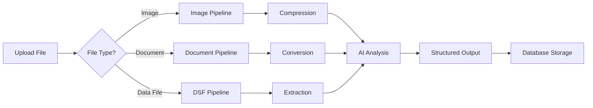

# KMRL - Intelligent Document Automation System

> **Prototype for PS 25080**  
> An AI-powered document management and automation system built with Next.js, Supabase, and Google Gemini AI.

[](https://nextjs.org/)
[](https://www.typescriptlang.org/)
[](https://reactjs.org/)
[]()

## 📋 Table of Contents

- [Overview](#overview)
- [Features](#features)
- [Tech Stack](#tech-stack)
- [Architecture](#architecture)
- [Getting Started](#getting-started)
- [Environment Variables](#environment-variables)
- [Project Structure](#project-structure)
- [API Routes](#api-routes)
- [User Roles](#user-roles)
- [Usage Guide](#usage-guide)
- [Contributing](#contributing)
- [License](#license)

## 🌟 Overview

KMRL is an intelligent document automation system designed to streamline notice management and document processing for organizations. The system leverages Google Gemini AI to automatically extract structured information from various document formats, including images, PDFs, Office documents, and data files.

### Key Capabilities

- **AI-Powered Document Analysis**: Automatic extraction of title, insights, deadlines, severity, and departments from uploaded documents
- **Multi-Format Support**: Handles images (JPG, PNG, WebP), documents (PDF, DOC, PPT, XLS), and data files (JSON, CSV, XML, TXT)
- **Smart Routing**: Intelligent file routing based on document type for optimized processing
- **Department Management**: Multi-department notice distribution system
- **Real-time Processing**: Live upload progress tracking with status feedback
- **User Authentication**: Secure authentication and profile management via Supabase

## ✨ Features

### 🎯 Core Features

- **Dashboard**: 
  - View and manage organizational notices
  - Filter by severity (High, Medium, Low)
  - Department-specific notice routing
  - Real-time upload progress tracking

- **Document Hub**: 
  - Centralized document repository
  - Download and view document metadata
  - Advanced search capabilities
  - Document version tracking

- **Senior Insights**: 
  - Analytics and reporting dashboard
  - Trend analysis for notices and documents
  - Department-wise statistics

- **AI Chatbot**: 
  - Intelligent query handling
  - Document-related Q&A
  - Natural language interface

### 🤖 AI-Powered Processing

- **Document Summarization**: Automatic extraction of key information
- **Image OCR**: Text extraction from image-based documents
- **Data File Parsing**: Support for JSON, CSV, XML, and TXT files
- **Smart Compression**: Automatic file optimization for storage
- **Structured Data Extraction**: JSON-formatted output for easy integration

## 🛠️ Tech Stack

### Frontend
- **Framework**: Next.js 15.5.3 (App Router)
- **UI Library**: React 19.1.0
- **Styling**: 
  - Tailwind CSS 4.x
  - Bootstrap 5.3.8
  - React Bootstrap 2.10.10
- **Icons**: React Icons 5.5.0
- **Notifications**: React Toastify 11.0.5

### Backend
- **Runtime**: Node.js
- **API**: Next.js API Routes
- **Authentication**: Supabase Auth
- **Database**: Supabase (PostgreSQL)

### AI & Processing
- **AI Model**: Google Gemini 2.5 Flash via `@google/genai`
- **Image Processing**: Sharp 0.34.4
- **PDF Processing**: pdf-lib 1.17.1
- **Office Conversion**: libreoffice-convert 1.7.0
- **Data Parsing**: 
  - PapaParse 5.5.3 (CSV)
  - xml2js 0.6.2 (XML)

### Development Tools
- **Language**: TypeScript 5.x
- **Linting**: ESLint 9.x
- **Package Manager**: npm

## 🏗️ Architecture

```
┌─────────────────────────────────────────────────────────────┐
│                         Frontend                             │
│  ┌─────────────┐  ┌──────────┐  ┌──────────┐  ┌──────────┐│
│  │  Dashboard  │  │   Hub    │  │ Insights │  │ Chatbot  ││
│  └─────────────┘  └──────────┘  └──────────┘  └──────────┘│
└───────────────────────────┬─────────────────────────────────┘
                            │
                            ▼
┌─────────────────────────────────────────────────────────────┐
│                      API Layer (Next.js)                     │
│  ┌───────────────────────────────────────────────────────┐  │
│  │  Document Processing Pipeline                          │  │
│  │  ┌──────────┐  ┌─────────────┐  ┌─────────────────┐  │  │
│  │  │ Staging  │→ │ Conversion  │→ │ Summarization   │  │  │
│  │  └──────────┘  └─────────────┘  └─────────────────┘  │  │
│  └───────────────────────────────────────────────────────┘  │
└───────────────────────────┬─────────────────────────────────┘
                            │
                            ▼
┌─────────────────────────────────────────────────────────────┐
│                   External Services                          │
│  ┌──────────────┐           ┌─────────────────┐            │
│  │   Supabase   │           │  Google Gemini  │            │
│  │  (Auth & DB) │           │   (AI Engine)   │            │
│  └──────────────┘           └─────────────────┘            │
└─────────────────────────────────────────────────────────────┘
```

### Document Processing Flow

1. **Upload** → File uploaded to staging endpoint
2. **Routing** → System determines file type and routes to appropriate processor
3. **Conversion** → Office files converted to PDF/images
4. **Compression** → Images/PDFs optimized for storage
5. **AI Analysis** → Gemini AI extracts structured information
6. **Storage** → File and metadata saved to Supabase
7. **Presentation** → Structured data displayed in dashboard

## 🚀 Getting Started

### Prerequisites

- Node.js 20.x or higher
- npm/yarn/pnpm/bun
- Supabase account
- Google Gemini API key

### Installation

1. **Clone the repository**

```bash
git clone https://github.com/yourusername/KMRL.git
cd KMRL
```

2. **Install dependencies**

```bash
npm install
# or
yarn install
# or
pnpm install
```

3. **Set up environment variables**

Create a `.env.local` file in the root directory:

```env
NEXT_PUBLIC_SUPABASE_URL=your_supabase_url
NEXT_PUBLIC_SUPABASE_PUBLISHABLE_KEY=your_supabase_anon_key
GEMINI_API_KEY=your_gemini_api_key
```

4. **Set up Supabase**

Create the following table in your Supabase project:

```sql
-- profiles table
CREATE TABLE profiles (
  id UUID REFERENCES auth.users PRIMARY KEY,
  first_name TEXT,
  last_name TEXT,
  designation TEXT,
  department TEXT,
  created_at TIMESTAMP WITH TIME ZONE DEFAULT NOW(),
  updated_at TIMESTAMP WITH TIME ZONE DEFAULT NOW()
);

-- notices table (optional, if storing notices in DB)
CREATE TABLE notices (
  id UUID DEFAULT uuid_generate_v4() PRIMARY KEY,
  title TEXT NOT NULL,
  actionable_insights TEXT,
  deadline DATE,
  severity TEXT CHECK (severity IN ('High', 'Medium', 'Low')),
  authorized_by TEXT,
  departments JSONB,
  file_name TEXT,
  file_url TEXT,
  uploaded_by UUID REFERENCES auth.users,
  created_at TIMESTAMP WITH TIME ZONE DEFAULT NOW()
);
```

5. **Run the development server**

```bash
npm run dev
# or
yarn dev
# or
pnpm dev
```

6. **Open your browser**

Navigate to [http://localhost:3000](http://localhost:3000)

## 🔐 Environment Variables

| Variable | Description | Required |
|----------|-------------|----------|
| `NEXT_PUBLIC_SUPABASE_URL` | Your Supabase project URL | ✅ Yes |
| `NEXT_PUBLIC_SUPABASE_PUBLISHABLE_KEY` | Supabase anonymous/public key | ✅ Yes |
| `GEMINI_API_KEY` | Google Gemini API key for AI processing | ✅ Yes |

### Getting API Keys

- **Supabase**: Sign up at [supabase.com](https://supabase.com) and create a project
- **Gemini API**: Get your key from [Google AI Studio](https://makersuite.google.com/app/apikey)

## 📁 Project Structure

```
KMRL/
├── app/                          # Next.js App Router
│   ├── api/                      # API Routes
│   │   ├── summarization/        # Document processing endpoints
│   │   │   ├── document/         # Document-specific routes
│   │   │   │   ├── compression/  # PDF/image compression
│   │   │   │   ├── conversion/   # Office file conversion
│   │   │   │   ├── staging/      # Initial file upload
│   │   │   │   └── summarization/ # Gemini AI processing
│   │   │   ├── dsf/              # Data Structured Files (JSON, CSV, XML, TXT)
│   │   │   │   ├── extraction/   # File-type specific extractors
│   │   │   │   ├── staging/      # DSF file upload
│   │   │   │   └── summarization/ # Text summarization
│   │   │   └── image/            # Image processing routes
│   │   │       ├── compression/  # Image optimization
│   │   │       ├── staging/      # Image upload
│   │   │       └── summarization/ # OCR & analysis
│   │   └── others/               # User-related endpoints
│   │       ├── profile/          # User profile management
│   │       └── upload-notice/    # Notice upload
│   ├── auth/                     # Authentication pages
│   │   ├── login/                # Login page
│   │   └── sign-up/              # Registration page
│   ├── user/                     # User dashboard pages
│   │   ├── director/             # Director dashboard
│   │   ├── brach-manager/        # Branch manager dashboard
│   │   └── others/               # General user dashboard
│   ├── error/                    # Error pages
│   ├── layout.tsx                # Root layout
│   ├── page.tsx                  # Home page
│   └── globals.css               # Global styles
├── components/                   # React components
│   ├── others/                   # User dashboard components
│   │   ├── dashboard.tsx         # Notice management
│   │   ├── hub.tsx               # Document repository
│   │   ├── insights.tsx          # Analytics dashboard
│   │   └── chatbot.tsx           # AI chatbot interface
│   ├── Footer.tsx                # Footer component
│   ├── secondPage.tsx            # Landing page section
│   └── thirdPage.tsx             # Landing page section
├── section/                      # Landing page sections
│   └── herosection.tsx           # Hero section
├── utils/                        # Utility functions
│   └── supabase/                 # Supabase client utilities
├── public/                       # Static assets
│   └── images/                   # Images and icons
├── ai-codes/                     # AI integration code samples
├── .env.local                    # Environment variables (not in git)
├── next.config.ts                # Next.js configuration
├── tailwind.config.ts            # Tailwind CSS configuration
├── tsconfig.json                 # TypeScript configuration
└── package.json                  # Dependencies and scripts
```

## 🔌 API Routes

### Document Processing

#### 1. Document Staging
**POST** `/api/summarization/document/staging`
- Accepts: PDF, DOC, DOCX, PPT, PPTX, XLS, XLSX
- Routes to appropriate conversion pipeline

#### 2. Document Conversion
- **POST** `/api/summarization/document/conversion/doc` - Word documents
- **POST** `/api/summarization/document/conversion/ppt` - PowerPoint files
- **POST** `/api/summarization/document/conversion/xls` - Excel spreadsheets

#### 3. Document Compression
**POST** `/api/summarization/document/compression`
- Optimizes PDF and image file sizes

#### 4. Document Summarization
**POST** `/api/summarization/document/summarization`
- Gemini AI extraction of structured data
- Returns JSON with title, insights, deadline, severity, departments

### Image Processing

#### 1. Image Staging
**POST** `/api/summarization/image/staging`
- Accepts: JPG, JPEG, PNG, WebP

#### 2. Image Compression
**POST** `/api/summarization/image/compression`
- Optimizes image file sizes using Sharp

#### 3. Image Summarization
**POST** `/api/summarization/image/summarization`
- OCR and content extraction via Gemini Vision

### Data File Processing

#### 1. DSF Staging
**POST** `/api/summarization/dsf/staging`
- Accepts: JSON, CSV, XML, TXT

#### 2. DSF Extraction
- **POST** `/api/summarization/dsf/extraction/json` - JSON parsing
- **POST** `/api/summarization/dsf/extraction/csv` - CSV parsing
- **POST** `/api/summarization/dsf/extraction/xml` - XML parsing
- **POST** `/api/summarization/dsf/extraction/txt` - Text extraction

#### 3. DSF Summarization
**POST** `/api/summarization/dsf/summarization`
- Text-based summarization

### User Management

#### 1. Profile Management
- **GET** `/api/others/profile` - Fetch user profile
- **POST** `/api/others/profile` - Update user profile

#### 2. Notice Upload
**POST** `/api/others/upload-notice`
- Upload notice with file attachment
- Saves to database with metadata

## 👥 User Roles

The system supports three user roles:

### 1. Director
- High-level analytics and insights
- Cross-department oversight
- Strategic decision-making interface

### 2. Branch Manager
- Department-specific management
- Team coordination
- Notice approval and distribution

### 3. Others (General Users)
- Access to four main modules:
  - **Dashboard**: View and upload notices
  - **Hub**: Browse document repository
  - **Insights**: View analytics and trends
  - **Chatbot**: AI-powered assistance

## 📖 Usage Guide

### Uploading a Notice

1. Navigate to the Dashboard
2. Click "Upload Notice" button
3. Select a file (or drag and drop)
4. Wait for AI processing (auto-fills form fields)
5. Review/edit extracted information:
   - Title
   - Actionable Insights
   - Deadline
   - Severity (High/Medium/Low)
   - Authorized By
   - Target Departments
6. Click "Upload" to save

### Document Processing Flow



### Supported File Formats

| Category | Extensions | Processing Method |
|----------|-----------|-------------------|
| **Images** | .jpg, .jpeg, .png, .webp | OCR + Vision AI |
| **Documents** | .pdf, .doc, .docx, .ppt, .pptx, .xls, .xlsx | Conversion + OCR |
| **Data Files** | .json, .csv, .xml, .txt | Text extraction + NLP |

### AI Extraction Output Format

The Gemini AI extracts information into this JSON structure:

```json
{
  "success": true,
  "extractedNotice": {
    "title": "System Maintenance Notice",
    "insights": "Critical system update required before deadline",
    "deadline": "2025-12-31",
    "severity": "High",
    "authorizedBy": "IT Department",
    "departments": ["Engineering", "Operations"]
  }
}
```

## 🎨 Features in Detail

### 1. Dashboard Component

**Key Capabilities:**
- Real-time notice list with search functionality
- Multi-department filtering
- Severity-based color coding (Red: High, Yellow: Medium, Green: Low)
- Upload with progress tracking
- Modal-based detail views

**Tech Implementation:**
- React Bootstrap modals for UI
- XHR for upload progress tracking
- React hooks for state management
- Automatic form population from AI results

### 2. Document Hub

**Key Capabilities:**
- Centralized document repository
- Download functionality with fallback handling
- Document metadata display
- Search and filter capabilities

**Tech Implementation:**
- Next.js Image optimization
- Dynamic document URL generation
- Responsive grid layout
- File type detection and routing

### 3. AI Processing Pipeline

**Stages:**

1. **Staging** - Initial file validation and routing
2. **Conversion** - Office files → PDF using LibreOffice
3. **Compression** - Size optimization using Sharp/pdf-lib
4. **Summarization** - Gemini AI extraction

**Key Features:**
- Automatic file type detection
- Smart routing based on MIME type
- Progress callbacks for user feedback
- Error handling and retry logic

## 🧪 Development

### Scripts

```bash
# Development server
npm run dev

# Production build
npm run build

# Start production server
npm start

# Lint code
npm run lint
```

### Code Style

- **TypeScript**: Strict mode enabled
- **ESLint**: Extended Next.js configuration
- **Formatting**: 2-space indentation
- **Imports**: Path aliases via `@/*`

### Adding New File Types

1. Create extraction endpoint in `app/api/summarization/[type]/extraction/`
2. Update `getStagingEndpointForFilename()` in components
3. Add MIME type handling in staging routes
4. Test with sample files

## 🐛 Troubleshooting

### Common Issues

**1. AI Processing Fails**
- Check Gemini API key is valid
- Verify file format is supported
- Check API rate limits

**2. File Upload Stuck**
- Check file size limits (default: 10MB)
- Verify network connectivity
- Check browser console for errors

**3. Supabase Authentication Issues**
- Verify environment variables are set
- Check Supabase project is active
- Confirm auth settings in Supabase dashboard

**4. Office File Conversion Errors**
- Ensure LibreOffice is installed on server
- Check file permissions
- Verify file is not corrupted

## 🔒 Security

- **Authentication**: Supabase Auth with JWT
- **File Upload**: Server-side validation
- **API Keys**: Environment variable isolation
- **Database**: Row Level Security (RLS) enabled
- **Input Sanitization**: All user inputs validated

## 🚢 Deployment

### Vercel (Recommended)

1. Push code to GitHub
2. Import project in Vercel
3. Add environment variables
4. Deploy

```bash
# Or use Vercel CLI
npm i -g vercel
vercel --prod
```

### Self-Hosted

```bash
# Build for production
npm run build

# Start production server
npm start
```

**Requirements:**
- Node.js 20+ runtime
- LibreOffice installed (for office file conversion)
- Environment variables configured

## 🤝 Contributing

Contributions are welcome! Please follow these steps:

1. Fork the repository
2. Create a feature branch (`git checkout -b feature/AmazingFeature`)
3. Commit your changes (`git commit -m 'Add some AmazingFeature'`)
4. Push to the branch (`git push origin feature/AmazingFeature`)
5. Open a Pull Request

### Development Guidelines

- Write TypeScript with proper types
- Follow existing code style
- Add comments for complex logic
- Test thoroughly before submitting

## 📄 License

This project is private and proprietary. All rights reserved.

## 🙏 Acknowledgments

- **Next.js** - The React Framework
- **Supabase** - Open source Firebase alternative
- **Google Gemini** - Advanced AI capabilities
- **Vercel** - Deployment platform

## 📞 Support

For issues and questions:
- Create an issue in the repository
- Contact the development team
- Check documentation at `/docs`

---

**Built with ❤️ for PS 25080**

*Last Updated: June 2026*
